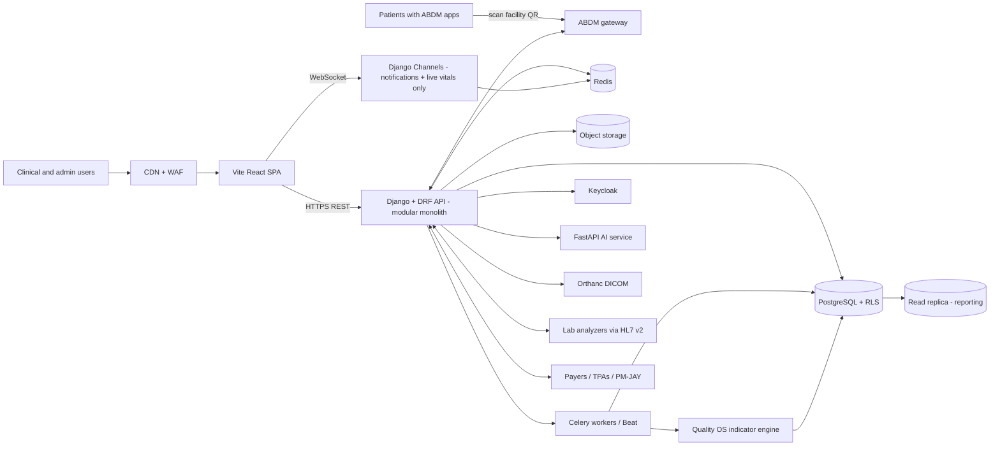
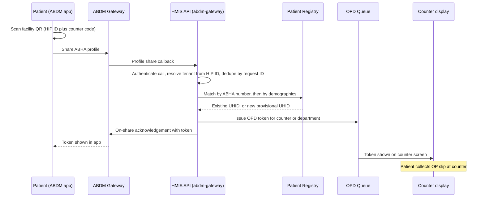
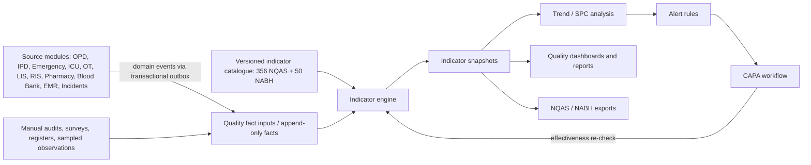
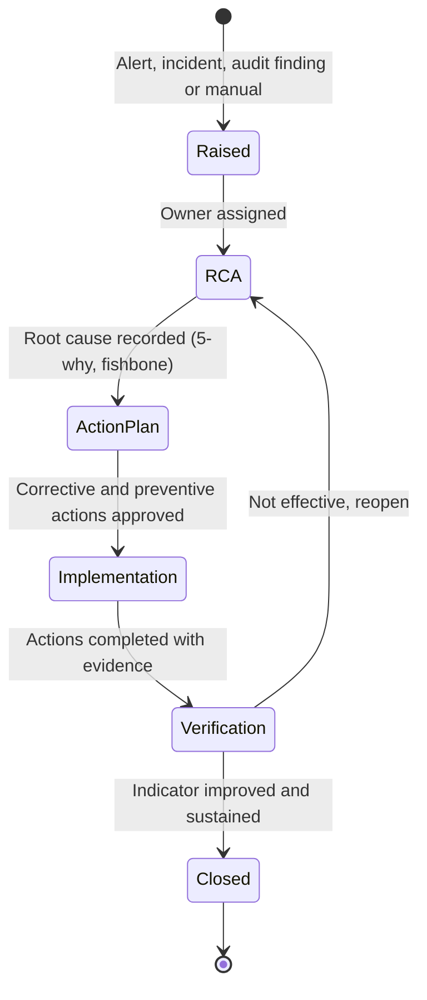

# SaaS HMIS: Architecture Document

**Version:** 0.6 (draft) | **Status:** For review | **Date:** 1 Oct 2026

**Changes (UI layer, v0.6 amendment A):** the frontend UI layer was migrated from Ant Design 5 + ProComponents to **Shadcn UI** on Tailwind CSS v4 with Radix primitives and `lucide-react` icons. Charts are hand-rolled inline SVG. See §4 (Technology Stack) and the new **§14.1** for the decision table, rationale, and constraints. `@ant-design/charts` is removed.

**Changes from v0.5:** reconciled against the uploaded SRS/PRD baseline; added facility setup as a first-class configuration capability, added the Blood Bank module, added department-driven registration/admission, formalised the NQAS workbook sheet-to-service mapping, corrected the generic Quality OS treatment of LAMA/absconding so source-specific definitions always take precedence, and promoted the 406-indicator catalogue/provenance model to the canonical baseline.

**Changes from v0.4:** replaced the NestJS/TypeScript backend with a Django + Django REST Framework modular monolith. **Django Channels is deliberately restricted to the real-time notification engine and live vitals dashboards only**; other operational screens continue to use REST with polling/refetching. BullMQ is replaced by Celery + Celery Beat for background jobs and scheduling.

**Changes from v0.1:** added ABHA QR self-registration (Scan and Share), added the Quality OS module (NQAS for government, NABH for private hospitals), updated the module map, data architecture, security, integrations, risks and delivery phases.

---

## 1. Purpose and Scope

This document defines the target architecture for a multi-tenant SaaS Hospital Management Information System (HMIS) serving hundreds of **government and private** hospitals, each averaging \~100 beds, with an India-first compliance posture (DPDP Act, ABDM/ABHA, NQAS, NABH).

**In scope (12 modules):** OPD, IPD, Emergency, ICU, OT, LIS, RIS, Pharmacy, **Blood Bank**, Insurance/Billing, EMR, and **Quality OS**, all built on a single patient registration shared across modules. **Facility setup, departments and wards are tenant configuration, not separate modules.**

**Registration channels:** existing front-desk registration, plus **patient self-registration by scanning the facility's ABHA QR code**.

**Out of scope for v1:** native mobile apps, telemedicine video, payer-side systems, and NQAS facility levels other than District Hospital (the catalogue keeps facility level as a dimension so they can be added later).

## 2. Scale Assumptions

These are planning assumptions to validate, not measurements.

| Dimension | Assumption |
| --- | --- |
| Tenants (hospitals) | 300 in year 1-2, growth path to 1,000+ |
| Beds per tenant | \~100 (range 30-500) |
| Concurrent users per tenant | 50-150 at peak |
| Platform peak concurrency | \~15,000-45,000 users |
| Write profile | Bursty; heaviest 9am-1pm (OPD) plus continuous IPD/ICU charting |
| Quality workload | Batch-oriented: nightly and month-end indicator computation per tenant |
| Data retention | Clinical records retained for years; append-mostly |

**Conclusion:** moderate scale, data-integrity-critical. Correctness, isolation and auditability matter far more than extreme throughput.

## 3. Architecture Principles

1. **Isolation first.** A tenant must never see another tenant's data. Enforced in the database, not only in application code.
2. **Modular monolith, not microservices.** One deployable, strict module boundaries, events via an outbox. Extract services only when a trigger in section 17 is hit.
3. **Standards-based.** FHIR as the canonical clinical model, HL7 v2 and DICOM at the edges.
4. **Everything auditable.** Every read and write of patient data is logged immutably.
5. **Quality by design.** Source modules capture the structured fields that quality indicators need (for example discharge disposition), so indicators calculate automatically instead of being re-entered.
6. **Standards as data, not code.** NQAS and NABH indicator sets are versioned catalogue entries, so a new edition is a data update.
7. **Boring technology.** Prefer mature, widely-hired-for tools.
8. **Configuration over module proliferation.** Departments, wards, beds, service units and staff positions are tenant configuration, editable over time; OPD/IPD are generic engines driven by that configuration.
9. **Data stays in India.** All PHI is stored and processed in Indian regions.

## 4. Technology Stack

| Layer | Choice | Notes |
| --- | --- | --- |
| Frontend | React + TypeScript, **Vite SPA** | No SSR needed; the app sits behind authentication |
| UI | **Shadcn UI** (Tailwind + Radix) — replaces Ant Design 5 | Copied-source components via CLI; `lucide-react` icon set; semantic tokens (`bg-primary`, `text-foreground`) replace `ConfigProvider` theming |
| Charts | **Inline SVG** (hand-rolled donut with `stroke-dasharray`, bars via SVG primitives) | No `@ant-design/charts`, no `recharts`; avoids dependency sync and keeps bundle small |
| Component registry | `components.json` + `src/components/ui/` | `Button`, `Card`, `Badge`, `Input`, `Label`, `Dialog`, `Tabs`, `Avatar`, `Tooltip`, `Toast`, `ScrollArea`, `Progress`, `DropdownMenu`, `Separator`, `Select` (planned)
| Data fetching | TanStack Query | Server-state cache and refetching |
| Forms/validation | React Hook Form + Zod | Frontend validation; API contracts are generated from OpenAPI |
| UI state | Zustand | Active patient tabs, UI preferences |
| Backend | **Django + Django REST Framework (Python)**, modular monolith | REST API; ASGI runtime. Django Channels is isolated to the real-time notification and live-vitals endpoints only |
| Backend runtime | **ASGI + Uvicorn/Daphne** | Serves Django/DRF and the dedicated Django Channels WebSocket consumers |
| ORM | **Django ORM + psycopg** | PostgreSQL transactions, migrations, and tenant-aware application access |
| Async workers | **Celery + Celery Beat** | Background jobs; not used as the realtime transport |
| Realtime | **Django Channels** | WebSocket consumers only for notifications and live vitals; Redis channel layer |
| Database | **PostgreSQL** (managed) with RLS | One shared DB, `tenant_id` on every table |
| Cache / channel layer | Redis | Cache, session support where required, Celery broker/result backend, and Django Channels fan-out for notifications/live vitals only |
| Jobs / scheduler | **Celery + Celery Beat** (Redis-backed) | Indicator computation, reports, asynchronous notifications, integrations, outbox dispatch; kept off the request path |
| Object storage | S3-compatible | Documents, CAPA evidence, report PDFs |
| Imaging | Orthanc (DICOM server) | For RIS |
| AI / analytics | Python FastAPI service | Isolated; ML, OCR, advanced statistics only |
| Identity | Keycloak | OIDC/SAML SSO, MFA, RBAC roles |
| Infra | Containers on managed Kubernetes (or ECS to start), Terraform | Indian region |
| Observability | OpenTelemetry, Grafana stack, Sentry | Logs, metrics, traces |

## 5. System Context

**Runtime boundary:** Django/DRF owns the synchronous application API. Celery owns background work. Django Channels is a constrained realtime adapter only for notification delivery and live vitals dashboards.




## 6. Backend Module Design

One Django project, one Django app per bounded context. Apps communicate through **public service interfaces and domain events**, never by reaching into each other's tables. Django Channels is kept in a dedicated realtime boundary and does not become a general-purpose transport for domain modules.

Suggested Django layout: `config/` (settings, ASGI, URLs), `apps/<bounded-context>/` for domain apps, `apps/realtime/` for Channels consumers/routing only, `workers/` for Celery tasks, and `common/` for shared infrastructure such as tenant context, auditing primitives and outbox helpers.

| Module | Responsibility |
| --- | --- |
| `identity-tenancy` | Tenants, facilities, users, roles, tenant context resolution |
| `patient-registry` | Single patient registration (UHID), demographics, ABHA linkage, merge/dedupe, **intake channels** |
| `abdm-gateway` | ABDM callbacks, ABHA verification, Scan and Share, token issuing, consent flows |
| `opd` | Appointments, queue and tokens, consultations |
| `ipd` | Admission, bed management, daily census, transfers, discharge |
| `emergency` | Triage, ER tracking board |
| `icu` | Critical-care charting, vitals flowsheets |
| `ot` | Scheduling, surgical notes, anesthesia records |
| `lis` | Orders, samples, results, analyzer integration |
| `ris` | Imaging orders, reports, PACS link |
| `pharmacy` | Formulary, dispensing, stock |
| `blood-bank` | Donors, collection/testing, component inventory, requisition, cross-match, issue, transfusion reactions, discards |
| `billing-insurance` | Charges, invoices, claims, pre-auth |
| `emr` | Clinical documents, problem list, FHIR resources |
| `quality-os` | Indicator catalogue and engine, trends, alerts, CAPA, assessments, regulatory exports (section 9) |
| `audit` | Immutable access/change log |
| `integration` | FHIR, HL7 v2, payer adapters |
| `platform` | Notifications, files, jobs, feature flags; notification persistence and delivery orchestration |
| `realtime` | Django Channels consumers and channel-group authorization **only** for notification delivery and live vitals dashboards |

**Rules:** no cross-module database joins; each module owns its tables (schema per module inside the one database); cross-module reads go through interfaces; state changes publish events via a transactional outbox. `quality-os` reads from its own fact tables, which are filled from those events, never from other modules' tables directly.

### 6.1 Facility setup and configuration model

Hospitals configure their own operational structure during onboarding and can edit it later. There are no per-department application modules.

**Structure**

- **Facility** -> **Departments** -> **Wards** -> **Beds**. Departments carry OPD/IPD capability flags; wards carry type tags (for example Medical, Surgical, Maternity, Paediatric, ICU, SNCU, NRC); beds carry functional/non-functional status.
- **Service units without beds:** operation theatres, labour room, laboratory, radiology, pharmacy, blood bank, mortuary, CSSD and similar units, each with a type tag.
- **Staff positions:** sanctioned and in-position counts by designation, specialty and department.
- **Reference data:** catchment population, ambulances, essential drug/commodity lists and other indicator denominators.
- **Indicator applicability:** driven by facility configuration and the source catalogue.

**Setup wizard**

1. Hospital details: name, ownership, facility level, address, ABDM/HFR identifiers and accreditation profile.
2. Departments: create/edit with OPD-enabled and IPD-enabled flags.
3. Wards and beds under departments.
4. Service units and type tags.
5. Staff positions and counts.
6. Reference data and indicator inputs.
7. Users, roles, registration counters and QR codes.

**Editing and history**

- Every setting is effective-dated; edits create new versions instead of destructive overwrites.
- Historical departments/wards/beds/service units are deactivated rather than deleted.
- All configuration changes are audited.
- Indicator applicability is recalculated when configuration changes, while locked indicator periods continue to use the configuration effective for that period.

## 7. Multi-Tenancy

**Model:** shared database, shared schema, `tenant_id` on every tenant-owned row, enforced with PostgreSQL Row-Level Security.

**Request flow**

1. JWT from Keycloak carries `tenant_id`, `facility_id`, `roles`.
2. Django middleware/service-layer transaction handling opens the transaction and sets PostgreSQL session variables before tenant-owned queries run.
3. RLS policies filter every query using those variables.

```sql
-- Set per transaction by the API
SELECT set_config('app.tenant_id', $1, true);

ALTER TABLE ipd.admissions ENABLE ROW LEVEL SECURITY;
ALTER TABLE ipd.admissions FORCE ROW LEVEL SECURITY;

CREATE POLICY tenant_isolation ON ipd.admissions
  USING (tenant_id = current_setting('app.tenant_id')::uuid)
  WITH CHECK (tenant_id = current_setting('app.tenant_id')::uuid);
```

**Unauthenticated entry points (ABDM callbacks):** there is no user JWT on a gateway callback. The tenant is resolved from the facility's ABDM identifier (HIP ID) after the call is authenticated, and only then is the tenant context set (section 8.4).

**Safeguards**

- The app connects as a non-owner role without `BYPASSRLS`.
- Composite indexes lead with `tenant_id`.
- Automated tests attempt cross-tenant reads on every table; CI fails if any succeed.
- Migrations run under a separate privileged role.

**Premium tier:** large government or group hospitals can get a **dedicated database** with the same codebase, selected by tenant config at connection time.

## 8. Patient Registration Channels and ABHA QR Self-Registration

### 8.1 Channels

The `patient-registry` module treats registration as an **intake channel** feeding one registration pipeline.

| Channel | Who initiates | Notes |
| --- | --- | --- |
| Front-desk registration (existing) | Registration clerk | Manual entry, optional ABHA verification or creation at the counter |
| **ABHA QR (Scan and Share)** | Patient | Patient scans the facility QR with an ABDM-enabled app and shares their ABHA profile |
| Appointment/pre-registration | Patient or staff | Later phase |

All channels end in the same outcome: a patient record with a UHID and, for OPD, a queue token.

### 8.2 How Scan and Share works

Per NHA/ABDM material, the service lets patients register at OPD by scanning a facility-specific QR code at the registration counter. The patient scans with the ABHA app or another ABDM-enabled app (Aarogya Setu, EkaCare, and others), logs in or creates an ABHA, and shares their profile. The facility's HMIS receives the profile and issues a token; the token appears on counter screens and in the patient's app, and the patient then collects the OP slip. The service launched in October 2022 and is widely used in government hospitals, and private hospitals can enable it too.

The ABDM developer forum shows the technical shape: the facility QR carries the facility's HIP ID plus an optional free-form code (for example a counter or department ID); on sharing, the ABDM gateway calls a profile-share endpoint on the facility's registered callback host, and the HMIS answers with an acknowledgement. Profile-share is a mandatory test case in the ABDM integration milestones. The shared profile typically includes ABHA address and number, name, gender, year of birth, address, district and state, plus link-token details for later care-context linking.

> **Version caution.** The forum shows v1.0 and v3 API paths coexisting (the ABHA app was still calling the older flow while v3 existed). The `abdm-gateway` module must therefore sit behind an **adapter that supports both**, and the exact current spec must be confirmed against ABDM's sandbox documentation at build time.

### 8.3 Sequence



### 8.4 Design details

**Facility onboarding (per tenant facility)**

- Each facility is registered in ABDM's facility registry and as an HIP; the platform stores the facility's ABDM identifiers on the `facility` record.
- The platform generates **one QR per facility, optionally per counter or department**, using the code field to carry counter ID. QRs are printable from the admin UI and rotate on demand if compromised.
- **Counter display screens use REST polling/refetching for token updates; Django Channels is not used for OPD token boards.**

**Callback handling (unauthenticated endpoint, so hardened)**

- Authenticate every gateway call per ABDM's specification before touching data.
- Resolve the tenant from the HIP ID, then set RLS context.
- Idempotency on the gateway's request ID, so retries never create duplicate patients or tokens.
- Respond within the gateway's expected time; do heavy work (dedupe, notifications) asynchronously and acknowledge quickly.
- Strict timestamp and payload validation. The forum notes that malformed timestamps cause silent acknowledgement failures.
- Rate limiting per HIP ID, and alerting on abnormal volume.

**Patient matching and verification**

1. Exact match on ABHA number within the tenant → link to the existing UHID.
2. Otherwise a candidate search on name, year of birth, gender and mobile → if exactly one strong match, propose it; if ambiguous, put the record in a **verification queue** at the counter.
3. No match → create a **provisional** registration.
4. The front desk completes the missing details (for example a mobile number or an ID document where hospital policy requires) and marks it **verified**. Self-shared data is a starting point, not proof.

**Government vs private behaviour (tenant configuration)**

- Government: token plus OP slip printing is the default, with scheme/category fields (for example PM-JAY eligibility) captured at the counter.
- Private: option to skip the slip and go straight to billing/doctor queue; optional payment at registration.
- Both: configurable counters, token series per department, and display layout.

**Extensibility.** ABDM material notes that the same pattern is being extended to pharmacy counters, with lab, "Scan and Pay" and "Scan and Send" described as upcoming. The code field and counter model are therefore generic: `intake_point(type: opd|pharmacy|lab|billing, counter_id)`.

**Data minimisation and consent.** Store only fields needed for care and legal retention; the link token is stored encrypted and used only for care-context linking; the share is recorded as a consent event with timestamp, source app and purpose.

**Failure modes**

- Gateway or network down → front-desk channel continues unchanged; QR channel shows a "use the counter" message in the app flow where possible.
- Duplicate scans → idempotency returns the same token.
- Patient shares at the wrong facility → fixed counter-side by cancelling the token.

## 9. Quality OS Module

### 9.1 Purpose

Quality OS turns hospital operations data into **automatically calculated quality indicators**, **trend analysis**, **alerts** and **CAPA (corrective and preventive action)** workflows for NQAS and NABH. The catalogue is source-driven and versioned rather than hard-coded. Government tenants use the NQAS District Hospital profile in v1; private and other eligible hospitals can use the NABH 6th Edition profile, and a tenant can enable both where applicable.

### 9.2 Source-aligned indicator baseline

The previous architecture treated the exact indicator parameters as an open decision. That is now superseded by the two supplied source sets:

| Framework | Supplied source | Baseline | Scope | Count |
| --- | --- | --- | --- | ---: |
| NQAS | `NQAS_Outcome_Indicator_final.xlsx` | District Hospital | 30 hospital-wide KPIs + 326 indicators across 18 department/service sheets | **356** |
| NABH | `NABH Hospital Accreditation Standard 6th Edition January 2025.pdf` | 6th Edition, effective 1 Jan 2025 | 32 organisational KPIs + 18 department-specific KPIs | **50** |
| **Quality OS** | Both | Versioned source catalogue | All supplied indicators | **406** |

The NQAS workbook uses four indicator types: **Productivity, Efficiency, Clinical care and safety, Service Quality Indicator**. The department/service sheets are A&E Department, OPD, Labour Room, Maternity Ward, NRC, Paediatric Ward, SNCU, Laboratory, OT, PP Unit, ICU, IPD, Blood Bank, Radiology, Pharmacy, Auxiliary Services, Mortuary and General Admin.

The NABH 6th Edition places its KPI catalogue in the dedicated Key Performance Indicators section beginning at printed page 202. It contains **32 organisational KPIs and 18 department-specific KPIs**. The source provides standardized numerator/denominator definitions, monitoring frequencies, sampling guidance and notes on HIS/EMR capture. Where the system cannot collate numerator or denominator, the source states that at minimum manual numerator/denominator entry should be available. Department-specific KPIs are generally based on in-patients unless an indicator specifically says otherwise.

A detailed source-aligned catalogue is maintained in **`SaaS HMIS Quality OS Indicator Specification v0.2.md`**, with **`SaaS HMIS Quality OS Indicator Catalog v0.2.json`** as the machine-readable import seed. Together they form the implementation handoff for all 406 indicator definitions.

### 9.3 NQAS catalogue model

The NQAS workbook is the current source of truth for the District Hospital catalogue. Independent verification of the workbook gives **356 indicators across 19 sheets: 30 in the KPI sheet and 326 across 18 department/service sheets**. The four source categories total 112 Productivity, 84 Efficiency, 109 Clinical care and safety, and 51 Service Quality Indicator indicators.

The exact source sheet is retained because it determines the operational scope, denominator population and capture route. The following is the implementation mapping used by the HMIS:

| NQAS source sheet | Count | Primary HMIS source area | Typical capture route |
| --- | ---: | --- | --- |
| KPI | 30 | Cross-module / General Administration | Auto from operational data + configured reference data |
| A&E department | 17 | Emergency | Auto + structured clinical timestamps/forms |
| OPD | 30 | OPD | Auto + structured register fields |
| Labour Room | 16 | Labour Room / OT | Auto + structured forms/registers |
| Maternity Ward | 19 | IPD/Maternity | Auto + structured forms |
| NRC | 19 | IPD/NRC | Auto + structured forms |
| Paediatric ward | 19 | IPD/Paediatrics | Auto + structured forms |
| SNCU | 24 | ICU/Neonatal | Auto + structured forms |
| Laboratory | 22 | LIS | Auto from LIS + manual audit inputs where source requires |
| OT | 20 | OT | Auto from OT + structured clinical records |
| PP Unit | 21 | OPD/Family Planning | Auto + structured forms |
| ICU | 16 | ICU | Auto from ICU + structured forms |
| IPD | 11 | IPD | Auto from admissions/census/discharge |
| Blood Bank | 19 | Blood Bank | Auto from blood-bank transactions + structured reaction/QA forms |
| Radiology | 20 | RIS | Auto from RIS + manual QA/audit inputs |
| Pharmacy | 10 | Pharmacy | Auto from stock/dispensing + manual registers where needed |
| Auxiliary services | 14 | Platform/Facility services | Structured/manual forms |
| Mortuary | 6 | Mortuary | Auto + structured register |
| General Admin | 23 | Administration | Auto from system/reference data + structured/manual inputs |

**Implementation rule:** a source-specific definition always takes precedence over a generic cross-framework template. For example, the NQAS KPI-sheet LAMA rate is a percentage, A&E Absconding Rate is A&E-specific, and department-level Discharge Rate indicators remain independent catalogue entries.


The NQAS catalogue shall load all **356** supplied indicators without dropping source-specific department indicators. The 30 rows in the workbook's KPI sheet are hospital-wide District Hospital KPIs. The remaining 326 are department/service indicators. The source-specific `Discharge Rate` indicators in department sheets remain in the catalogue even though a generic cross-framework discharge-rate KPI had previously been removed from the starter set.

Every imported NQAS definition retains: source sheet, source S No, type, indicator name, numerator, denominator, formula, frequency, source of data and significance.

### 9.4 NABH catalogue model

The NABH catalogue shall load all **50** supplied KPIs:

- **32 organisational KPIs**, principally linked to PSQ 3a/3b/3d, covering assessment timeliness, diagnostic reporting/safety, medication safety, ICU outcomes, emergency returns, infection prevention, surgery, transfusion, hand hygiene, discharge, pharmacy stock-outs, patient safety incidents, handovers and prescriptions.
- **18 department-specific KPIs**, with named clinical applicability including Cardiology, Endocrinology, Obstetrics, Ophthalmology, Gastroenterology, Surgery, Rehabilitation Medicine, Sepsis Management, Respiratory/Pulmonary Medicine, Neurology, Paediatrics, Oncology, Nuclear Medicine, Radiology, Emergency Medicine and Nephrology.

Examples include ICU standardized mortality, ICU return within 48 hours, ED return within 72 hours, pressure-ulcer incidence, CAUTI/VAP/CLABSI, SSI, hand-hygiene compliance, prophylactic-antibiotic timing, surgical rescheduling, blood/component turnaround time, outpatient consultation waiting time, diagnostic waiting time, discharge time, patient falls, near misses, needlestick injuries and safe/rational prescription auditing. The full 50-row baseline, formulas and scope notes are in the companion indicator specification.

### 9.5 Quality OS architecture



**Submodules**

| Submodule | Responsibility |
| --- | --- |
| Source registry | Stores source document, edition, version, checksum/provenance and licensing status |
| Catalogue | Frameworks, editions, facility levels, scopes, indicator definitions, formulas, benchmarks and applicability |
| Scope resolver | Determines whether an indicator is hospital-wide, department/service-specific or named specialty and whether it is enabled for a tenant |
| Fact capture | Consumes domain events and maintains append-only quality facts and daily snapshots |
| Sampling/audit | Creates audit populations, sample plans, sampled observations and evidence for manual/hybrid indicators |
| Indicator engine | Computes numerator, denominator, value and data-quality status for each definition |
| Manual indicators | Controlled forms for system-unavailable or audit-based inputs, including manual numerator/denominator entry |
| Trend and SPC | Run charts, control charts, moving averages, period comparison and signal rules |
| Alerts | Rules fire on configured targets, statistical signals, sustained worsening or data-quality failure |
| CAPA | Issue → RCA → action plan → verification → closure, linked to indicators |
| Assessments | NQAS checklist and NABH objective-element self-assessment, evidence and scoring (phase 2) |
| Reporting/export | Monthly quality reports, committee packs and framework-oriented exports |

### 9.6 Indicator definition and provenance model

```text
framework                  (id, code: NQAS|NABH|CUSTOM, name)
framework_edition          (id, framework_id, edition, effective_from, status)
indicator_source_document  (id, framework_id, document_name, document_version, source_uri_or_file,
                             content_hash, imported_at, licensing_status)
facility_level             (id, framework_id, code: DH|CHC|PHC|UPHC|HOSPITAL|...)
indicator_def              (id, edition_id, source_document_id, source_code, source_sno,
                             source_locator, standard_ref, scope_type: overall|department|specialty,
                             scope_code, name, dimension, unit, direction, periodicity,
                             definition, numerator_spec, denominator_spec, formula_operator,
                             source_type: auto|manual|hybrid, sampling_required, sampling_method,
                             sample_size_spec, reporting_lag_days, source_of_data, system_capture_guide,
                             applicability, definition_version, status)
indicator_benchmark        (indicator_id, scope: national|state|internal, value, valid_from)
indicator_value             (tenant_id, facility_id, dept_id, indicator_id, definition_version,
                             period_start, period_end, numerator, denominator, value,
                             status: draft|provisional|locked|superseded|not_applicable,
                             computed_at, data_quality_flags)
capa                        (id, tenant_id, source_type, source_ref, title, severity, owner, due_date,
                             status, rca_method, root_causes, corrective_actions, preventive_actions,
                             effectiveness_indicator_id, effectiveness_check_date, closed_at)
```

**Key rules:**

- Framework-standard definitions are immutable after publication. A source revision creates a new definition version; historical values continue to point to the old version.
- NQAS and NABH definitions are not merged merely because names look similar. Shared computation is allowed only when numerator, denominator, population, unit, frequency and semantic definition are equivalent.
- The source S No, source sheet/standard and source page are persisted for auditability and assessor drill-through.
- Tenant administrators can enable/disable applicable indicators but cannot alter a framework-standard formula. Custom indicators use `CUSTOM` and their own version lifecycle.
- `auto`, `manual`, and `hybrid` calculation modes are first-class. This is especially important for NABH KPIs that rely on clinical audits, sampling or observations.

### 9.7 Computation and data trust

**Source-definition precedence:** the 406 source definitions are normative. Generic HMIS calculations are helper patterns only. The engine shall execute the formula/operator stored in the active `indicator_def`; it shall not substitute a generic formula because two indicators share a similar name.

- **Incremental compute:** event-driven facts are accumulated continuously; scheduled computation evaluates indicators at their configured frequency. Nightly recomputation remains the default reconciliation cycle.
- **Frequency support:** Monthly, Yearly and Continuous indicators are supported, as well as cumulative/YTD monitoring where the source specifies it.
- **Reporting lag:** each indicator can specify a reporting lag and provisional period. Late surveillance data, such as SSI follow-up, can update a provisional snapshot before month/period lock.
- **Sampling:** the engine stores population, sample plan, selection method, sample size, observations and audit evidence separately from automatically-derived facts.
- **Manual fallback:** where source guidance permits or requires manual collation, the UI accepts numerator/denominator (or count for count indicators), validates the entry and records user, time, source and evidence.
- **Data-quality flags:** missing timestamps, missing discharge disposition, invalid denominators, census gaps, orphan events, duplicate observations, insufficient sample and late data are surfaced rather than silently producing a number.
- **Drill-through:** each result opens its numerator/denominator contributing cases, sampled observations or manual evidence according to permission and audit policy.
- **Small numbers:** counts accompany rates; rare events use appropriate charts and the dashboard flags insufficient denominators/sample sizes.
- **Golden tests:** source formulas and known inputs are implemented as reproducible tests.

### 9.8 Trends, alerts and CAPA

**Trend analysis**

- Run charts with median/target lines; control charts (p, u, XmR or other appropriate method).
- Month-on-month, year-on-year, moving averages, benchmark overlays and department/specialty stratification.
- Cumulative/YTD views for indicators whose source methodology requires cumulative reporting.

**Alert triggers**

- Value outside a configured benchmark or tenant target.
- Statistical signal on the control chart.
- Sustained worsening for N consecutive periods.
- Required source data or audit evidence missing.
- Required framework indicator has reached its reporting deadline without a valid value.

**CAPA workflow**



CAPA records the issue, severity, RCA, corrective/preventive actions, owners, due dates, evidence and committee review. Each CAPA may link to an effectiveness indicator and a re-check date.

### 9.9 Dashboards, reports and exports

- **Catalogue view:** framework → edition → scope → indicator type/standard → indicator; filters by department, specialty, frequency, calculation mode and status.
- **Executive view:** selected headline indicators, trends and open CAPAs.
- **Quality manager view:** all enabled indicators, data-quality exceptions, audit/sample tasks, catalogue provenance and CAPA board.
- **Department/specialty view:** applicable indicators for that unit only, with drill-through and evidence.
- **Reports:** monthly quality report, committee pack, indicator register, source/provenance register.
- **Exports:** NQAS-oriented monthly indicators and NABH KPI registers, subject to approved formats/licensing.
- **Benchmarking:** optional anonymised cross-hospital benchmarking after legal review.

### 9.10 Governance and configuration

- **Source baseline:** the supplied NQAS workbook and supplied NABH 6th Edition PDF are the current product-owner-approved source snapshots for this release.
- **Catalogue ownership:** central product/quality team owns imports, review, version publication and migration notes.
- **Tenant profile:** NQAS District Hospital, NABH 6th Edition, both, or custom, subject to scope/applicability.
- **Framework definitions:** tenant admins cannot edit source definitions; they can enable/disable applicable indicators and configure internal targets/recipients where permitted.
- **Custom indicators:** tenant-specific definitions remain separate from NQAS/NABH source definitions.
- **Licensing:** NABH source text and methodology are copyright-protected; reproduction rights must be confirmed before customer-facing distribution of the catalogue or exports.
- **Future editions:** a new source edition creates a new `framework_edition` and source document record; previous indicator values remain reproducible.

## 10. Data Architecture

- **Patient identity:** one patient record per tenant (UHID), referenced by all modules. ABHA linkage; merge workflow with full history preserved; provisional vs verified status for self-registered patients.
- **Clinical model:** internal tables designed for operations; FHIR resources generated at the integration boundary.
- **Append-only clinical data:** corrections create new versions (amendment records), never destructive updates.
- **Quality data:** `quality` schema holds fact tables, daily snapshots, indicator values and CAPA; written by event consumers, read by the engine. Indicator values are denormalised and versioned for reproducible history.
- **Partitioning:** large tables (audit log, vitals, lab results, quality facts) partitioned by time, with `tenant_id` in the key.
- **Reporting:** read replica for operational and quality reports; revisit a columnar store (for example ClickHouse) only when analytics needs outgrow Postgres.
- **Search:** Postgres full-text and trigram for patient lookup; OpenSearch only if needed later.

**Required structured fields (quality by design)** for Quality OS to work:

| Source | Fields that must be structured |
| --- | --- |
| `ipd` | Admission and discharge timestamps, **discharge disposition** (routine/LAMA/absconded/referred/death), functional-bed register, midnight census, ward/department |
| `opd` | Visit type (new/follow-up), referral-out flag, registration time vs consultation time (wait time) |
| `emergency`, `icu`, `ot` | Triage times, device days, planned vs unplanned returns, procedure and prophylaxis timestamps |
| `lis`, `ris` | Order, collection and report timestamps (turnaround time), critical-result communication |
| `pharmacy` | Stock-out days by essential item, medication-error and ADR reports |
| `blood-bank` | Units collected/issued/discarded, component inventory, cross-match, issue/replacement/voluntary source, transfusion reactions, timestamps for requisition-to-issue |
| `emr` | Discharge summary completion, pressure-ulcer and fall events, infection surveillance entries |
| Incident module (within `quality-os`) | Incident type, severity, department, harm level |

**Quality OS source-driven data requirements**

The 406-indicator baseline makes the source-to-data mapping a first-class architecture artifact. In addition to the structured clinical fields above, each indicator mapping records source type (`auto|manual|hybrid`), source sheet/standard, scope, numerator/denominator specification, formula operator, frequency, sampling method, reporting lag, source-of-data field and applicability. The detailed mapping is maintained in `SaaS HMIS Quality OS Indicator Specification v0.2.md`; the normalized import seed is `SaaS HMIS Quality OS Indicator Catalog v0.2.json`.

## 11. Security and Compliance

**Access control**

- RBAC roles (doctor, nurse, pharmacist, lab tech, billing, quality manager, admin), plus ABAC rules (own department, assigned patient, break-glass access with mandatory reason).
- Quality OS drill-through to patient-level cases requires an explicit permission and is audited.
- MFA for privileged roles; SSO for hospital groups via OIDC/SAML.

**Data protection**

- TLS 1.2+ everywhere; mTLS between internal services where applicable.
- Disk/volume encryption with KMS-managed keys.
- Application-level field encryption for highly sensitive identifiers (for example government IDs and ABDM link tokens), with keys held in KMS, not in the database.
- Secrets in a secrets manager; no secrets in images or repos.

**Audit**

- Every read/write of patient data logged: who, what, when, from where, why (for break-glass).
- Append-only store, tamper-evident (hash chaining), retained per policy.

**Regulatory mapping**

| Requirement | Approach |
| --- | --- |
| DPDP Act | Consent records (including the ABHA profile share), purpose limitation, data-principal rights workflows, breach notification process, India data residency |
| ABDM | ABHA creation/linking, **Scan and Share**, consent manager flows, health information exchange via FHIR, milestone certification |
| NQAS | Area H indicator support, reporting up the quality chain, checklist assessments (phase 2) |
| NABH | KPI monitoring with data verification, CAPA evidence, objective-element self-assessment (phase 2) |
| Clinical record retention | Retention policy engine per record type |
| Enterprise customer audits | Documented controls, pen tests, SOC 2 / ISO 27001 roadmap |

> Legal interpretation of each requirement should be confirmed with counsel before finalizing.

## 12. Integrations

| Integration | Protocol | Notes |
| --- | --- | --- |
| ABDM gateway | REST / FHIR | ABHA, **profile share callbacks (v1.0 and v3 adapters)**, consent, record sharing |
| Lab analyzers | HL7 v2 (via MLLP bridge) | Bridge agent on hospital LAN; results flow to `lis` |
| Imaging modalities / PACS | DICOM | Orthanc per region; metadata in `ris` |
| Payers / TPAs / PM-JAY | REST / vendor APIs | Adapter per payer behind a common interface |
| Payment gateways | REST + webhooks | Idempotent webhook handling |
| SMS / WhatsApp / email | Provider APIs | Through `platform` notifications |
| Government quality reporting | File export first | API integration only if a body publishes one |

Each external integration lives behind an adapter interface in `integration`, so vendors can change without touching domain modules. Integration callbacks and normal API operations use Django/DRF; they do not use Django Channels.

## 13. Real-Time

**Django Channels is intentionally narrow in scope.** It is used only for:
1. the **real-time notification engine** (for example persisted critical alerts, user notifications, Quality OS alerts and integration-status notifications), and
2. **live vitals dashboards** for ICU/ward monitoring where clinically appropriate.

It is **not** used as the general transport for bed status, ER boards, OPD queues/token displays, ordinary CRUD updates, background jobs, ABDM callbacks, or domain-to-domain communication.

- Django runs under ASGI; Django Channels provides WebSocket consumers only for the two approved realtime use cases.
- Redis is the Django Channels channel layer and fan-out mechanism across API/ASGI instances.
- All realtime subscriptions are tenant-scoped and facility-scoped, with patient/ward/department authorization checked before joining a channel group.
- Notification records and clinically relevant alert state are persisted in PostgreSQL first; WebSocket delivery is a secondary realtime projection, not the source of truth.
- Live vitals are read from the authoritative clinical store and broadcast as incremental updates to authorized dashboard subscribers. The vitals history remains persisted and auditable.
- Clients fall back to REST polling/refetching through TanStack Query when a WebSocket is unavailable. Loss of the socket must never imply loss of a clinical record.
- OPD token boards, ER tracking boards, bed dashboards and other non-vitals operational displays continue to use REST polling/refetching.

## 14. Frontend Architecture

- Vite SPA, route-level code splitting per module to keep the initial bundle small (modules under `src/modules/` are lazy-loaded, including the clinical operations dashboard and patient registration).
- Module-folder structure under `src/modules/` mirroring backend apps (`src/modules/dashboard/`, `src/modules/patient_registry/`, `src/modules/auth/`).
- Typed API client generated from the Django REST Framework OpenAPI schema; Zod remains frontend-only for form/input validation.
- PWA service worker for asset caching and a **short-lived offline queue** for ward screens (drafts retained locally, clear "unsynced" indicators, conflict handling on resubmit). Clinical orders never appear "saved" until the server confirms.
- A **counter display** route (token board) designed for wall-mounted screens: large type, periodic REST polling/refetching, no login prompts, kiosk token scoped to display only. It does not use Django Channels.
- Accessibility and readability standards for long sessions; localization-ready (English first; Hindi and regional languages such as Mizo later).

### 14.1 UI system: Shadcn UI on Tailwind (replaces Ant Design)

The frontend UI layer was migrated from **Ant Design 5 + ProComponents** to **Shadcn UI**.

| Concern | Decision | Rationale |
| --- | --- | --- |
| Component source | Copied into `frontend/src/components/ui/` via `components.json` | Components are reviewed, versioned, and patched in-repo rather than consumed as a black-box dependency. Avoids the Ant Design v5-to-v6 coordinated major migration. |
| Styling | Tailwind CSS v4 via `@tailwindcss/vite` | Utility classes + semantic CSS variables replace the AntD `ConfigProvider` token system. Theme still centres on teal `#0f766e` (`--primary: 174 83% 25%`). |
| Primitives | Radix UI | Unstyled, accessible primitives that shadcn composes into styled source. |
| Icons | `lucide-react` | Replaces `@ant-design/icons`. Tree-shakeable, consistent stroke set. |
| Theming | CSS variables in `src/styles/globals.css` (`:root` / `.dark`) | Dark mode is class-driven; tokens are HSL triplets consumed as `hsl(var(--token))`. |
| Charts | Hand-rolled inline SVG | Donut via `stroke-dasharray` arcs; bars/funnels via SVG primitives. No `@ant-design/charts` and no `recharts` — avoids adding an unwired dependency. |

**Constraints carried into the new stack:**

- `components.json` is the source of truth for the registry; run `npx shadcn@latest add <component>` rather than hand-writing a component that already exists.
- Icons come from `lucide-react`, never from a CDN or an SVG asset.
- shadcn components are *owned* code: upstream changes arrive only via `shadcn add --diff`, and local edits are preserved deliberately.
- Accessibility is inherited from Radix but still required: `aria-label` on every icon-only `Button`, labelled inputs, keyboard-reachable interactions.
- Responsive behaviour uses Tailwind `sm:`/`md:`/`lg:`/`xl:` breakpoints rather than AntD `Row`/`Col` props.

## 15. Infrastructure and Deployment

**Environments:** dev, staging, production (production in an Indian region, multi-AZ).

**Runtime**

- Stateless Django/DRF API pods behind an ASGI-compatible server, autoscaled on CPU and request rate.
- Separate Celery worker deployment plus Celery Beat scheduler for indicator computation, reports, notifications and integrations; background work stays off the request path.
- Separate ASGI/WebSocket capacity for Django Channels may be scaled independently from REST traffic when live-vitals or notification concurrency grows.
- Managed PostgreSQL, multi-AZ, with a read replica and PITR.
- Managed Redis with replication, used for cache plus Celery transport and the Django Channels channel layer.
- A publicly reachable, rate-limited ingress path for ABDM callbacks, separate from the user-facing API routes.

**CI/CD**

- Trunk-based development; pipeline runs Python linting/format checks, Django checks, unit/integration tests, RLS isolation tests, **indicator golden tests** (known inputs produce known BOR/ALOS/LAMA values), Channels/WebSocket authorization tests, SAST and dependency scanning.
- Container images signed and scanned; progressive rollout (canary/blue-green).
- Database migrations are backward-compatible (expand, then contract).

**Reliability targets (proposed)**

| Metric | Target |
| --- | --- |
| Availability | 99.9% monthly |
| RPO | ≤ 5 minutes |
| RTO | ≤ 1 hour |
| API p95 latency | \< 300 ms for common reads |
| ABDM callback acknowledgement | Within the gateway's expected response time |
| Month-end indicator compute | Completes for all tenants within a defined overnight window |

**Backup and DR:** continuous WAL archiving, daily snapshots, cross-region encrypted copy (within India), restore drills at least quarterly.

## 16. Observability

OpenTelemetry traces across Django/DRF API, ASGI/Channels consumers and Celery workers; dashboards for latency, error rate, queue depth, ABDM callback success/failure, WebSocket connection/authentication failures, live-vitals delivery lag, and indicator-job success per tenant. Alerts on failed month-end jobs and data-quality regressions.

## 17. Evolution Triggers (when to split the monolith)

| Trigger | Action |
| --- | --- |
| Lab/imaging device traffic overwhelms API | Extract `integration`/`lis` ingestion as its own service |
| ABDM callback volume or availability needs diverge | Extract `abdm-gateway` |
| Quality compute contends with OLTP | Scale Celery workers independently, then move the indicator engine to a separate analytical store if required |
| Billing needs independent release cadence or scaling | Extract `billing-insurance` |
| Event volume or integrations need durable streaming | Introduce Kafka behind the existing outbox |
| Enterprise customers demand isolation | Dedicated DB or cluster tier |

## 18. Risks and Open Decisions

| # | Item | Decision / control needed |
| --- | --- | --- |
| 1 | Cloud provider and Indian region | AWS vs Azure vs Indian providers |
| 2 | Managed Kubernetes vs ECS at launch | Team ops capacity |
| 3 | Django tenancy/RLS implementation details | Standard middleware/transaction pattern; application role must not bypass RLS |
| 4 | Keycloak hosting | Self-managed vs managed operational model |
| 5 | ABDM sandbox and certification timeline | Gating for go-live |
| 6 | Hospital-LAN bridge agent for HL7/DICOM | Packaging and remote update model |
| 7 | Offline scope for ward workflows | Define clinically safe offline operations |
| 8 | Functional-bed denominator for BOR and BTR | Day-weighted from daily functional-bed register vs period average; confirm and encode in NQAS source definition |
| 9 | NQAS source snapshot governance | Maintain workbook version/hash and controlled imports; new source creates new catalogue version |
| 10 | NABH content licensing | Confirm rights to reproduce indicator text, definitions and guidance in UI/exports |
| 11 | NABH formula cells with source-specific methodology | Preserve numerator/denominator fields and verification status where the source uses ratio/definition-dependent calculation wording |
| 12 | Cross-hospital benchmarking | Legal review under DPDP before enabling |
| 13 | Government report formats | Confirm DQAU/SQAU and state templates; start with exports |

**Top risks:** cross-tenant data leakage; incorrect interpretation of source definitions; catalogue drift between official editions; missing structured source data; audit/sampling evidence gaps; incomplete specialty applicability; and copyright/licensing constraints for NABH material.

## 19. Suggested Delivery Phases

1. **Foundation:** tenancy, identity, patient registry with front-desk registration, audit, CI/CD, infra baseline, ABDM sandbox integration including **Scan and Share**.
2. **Core clinical:** OPD (tokens, queues), IPD (beds, census, discharge dispositions), EMR, billing basics, plus structured fields required by the Quality OS source mapping.
3. **Quality OS v1:** load the **complete 406-indicator catalogue** (356 NQAS + 50 NABH), implement catalogue/provenance/versioning, automatic calculations for indicators supported by live HMIS data, manual/hybrid collection forms for audit-derived items, dashboards, trends, alerts, CAPA and month-end close.
4. **Diagnostics and pharmacy:** LIS, RIS and pharmacy integrations; activates additional NQAS/NABH diagnostic, medication, turnaround-time, stock-out and safety indicators.
5. **Critical care and surgery:** Emergency, ICU, OT; activates ICU, infection, surgery, transfusion, emergency-return and specialty indicators.
6. **Insurance and ecosystem:** claims, TPAs, PM-JAY, full ABDM milestones; activates related source mappings where applicable.
7. **Quality OS v2 and hardening:** NQAS/NABH self-assessment, regulatory exports, catalogue governance tooling, optional benchmarking, performance, pen test, DR drills and certification preparation.

## Appendix A: Research Sources

- User-supplied `NQAS_Outcome_Indicator_final.xlsx`: District Hospital outcome indicator workbook containing 30 hospital-wide KPIs plus 326 department/service indicators across 18 sheets.
- User-supplied `NABH Hospital Accreditation Standard 6th Edition January 2025.pdf`: 6th Edition, effective 1 Jan 2025; dedicated KPI section begins at printed page 202 and contains 32 organisational KPIs plus 18 department-specific KPIs.
- ABDM and NHA material on Scan and Share (launch October 2022; QR-based profile share, token issuance) and the ABDM developer forum material on callback flow and API versioning; confirm exact current specification at build time.
- NHSRC NQAS material and the supplied NQAS workbook as the product-owner source of truth for the current catalogue.

*Next documents: UI design system, Quality OS UI specification, implementation service-to-indicator mapping, and README.*

### Source validation for v0.6

- The supplied NQAS workbook contains 356 numeric indicator rows: 30 on `KPI` plus 326 across 18 department/service sheets. Category counts verified from the workbook are 112 Productivity, 84 Efficiency, 109 Clinical care and safety, and 51 Service Quality Indicator.
- The supplied NABH 6th Edition identifies the dedicated KPI section at printed page 202; the source baseline used here contains 32 organisational KPIs and 18 department-specific KPIs.
